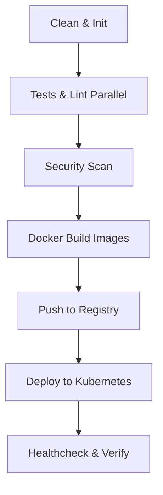

# Jenkins CI/CD Pipeline Guide

This project includes a production-ready declarative pipeline defined in [`jenkins/Jenkinsfile`](./Jenkinsfile) that automates linting, testing, Docker builds, container scanning, registry pushes, and rolling deployments to Kubernetes.

---

## 1. Prerequisites & Required Jenkins Plugins

Ensure the following plugins are installed in your Jenkins instance (**Manage Jenkins** -> **Plugins**):
- **Pipeline** (`workflow-aggregator`)
- **Docker Pipeline** (`docker-workflow`)
- **Credentials Plugin** (`credentials-binding`)
- **Kubernetes CLI Plugin** (`kubernetes-cli`)
- **Git Plugin** (`git`)

---

## 2. Credentials Configuration in Jenkins

Navigate to **Manage Jenkins** -> **Credentials** -> **System** -> **Global credentials (unrestricted)** -> **Add Credentials**:

1. **Docker Hub / Container Registry Credentials**:
   - **Kind**: `Username with password`
   - **ID**: `docker-hub-credentials`
   - **Username**: Your Docker Hub / Registry username
   - **Password**: Your Docker Hub Token or Password

2. **Kubernetes Kubeconfig Credentials**:
   - **Kind**: `Secret file` or `Kubeconfig`
   - **ID**: `k8s-kubeconfig`
   - **File**: Upload your cluster `~/.kube/config`

---

## 3. Creating the Pipeline Job in Jenkins

1. Go to Jenkins Dashboard -> **New Item**.
2. Enter item name: `mern-obsidian-todo-pipeline`.
3. Select **Pipeline** and click **OK**.
4. Scroll down to the **Pipeline** section:
   - **Definition**: `Pipeline script from SCM`
   - **SCM**: `Git`
   - **Repository URL**: Your Git repository URL
   - **Script Path**: `jenkins/Jenkinsfile`
5. Click **Save**.

---

## 4. Pipeline Stages Explained

1. **🧹 Workspace Clean & Init**: Checks out fresh code and initializes build workspace.
2. **🧪 Code Quality & Tests**: Executes backend tests and builds the frontend bundle in parallel.
3. **🔒 Security & Audit Scan**: Runs npm security audits for high/critical vulnerabilities.
4. **🐳 Docker Build**: Builds tagged container images for the Express API and Nginx-powered React client.
5. **📤 Push to Registry**: Authenticates and pushes images to Docker Hub / Container Registry.
6. **☸️ Deploy to Kubernetes**: Applies manifests in the `k8s/` folder with zero-downtime rolling updates.
7. **🩺 Post-Deploy Health Check**: Validates that all pods are in `Running` status and ingress routing is live.
